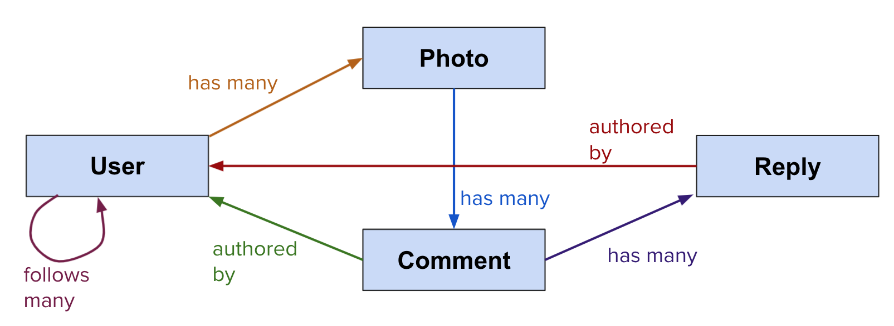
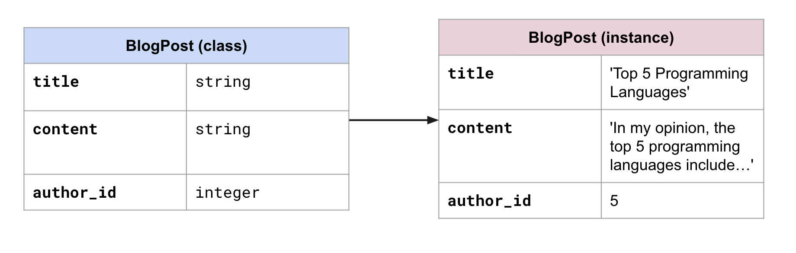
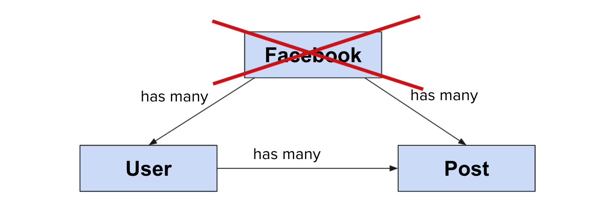

# What are Relationships?

In everyday life, we can use **relationships** to describe how the people or things around us are related to each other. For example, you might say that a child has a "relationship" with their mother and father. However, many families can't be described so neatly: A child could have a single parent, or two mothers, or two grandparents, or even more than two parents if re-marriages are involved!

When you start to store information in a database, those complexities start to matter in how we arrange our data. Let's say you are implementing a database for a school, and you need to figure out how to add a student's parents to their school record, so that the school knows who can pick up the child. If you leave only two fields for "Mother" and "Father", then you will leave out many students whose family relationships don't fit so neatly into those boxes. Instead, you might choose to have a _list_ of parents or guardians, with each `Parent` containing their relationship (mother, step-father, etc) to the child. That way, a child could have any number of parents who each have their own role.

How we handle those questions when planning or implementing a database is called **data modeling**.

The entity relationship diagram for `Parent` - `Child` might look like this:

## Example: Photo Sharing Site

So far, we've looked at an example with only two entities: Parent and Child. However, usually a database will contain many more entities.

Let's look at a photo sharing website that stores `User`s, `Photo`s, `Comment`s, and `Reply`s. A diagram of its relationships might look like this:

## What is an Entity?

An **entity**, also sometimes called a **resource**, is a category of objects that have fields in common. You could think of it kind of like a **class**.

For example, a `BlogPost` is an entity because each BlogPost _instance_ contains a `title`, `contents`, and an `author_id`.

## Common Pitfall: What is NOT an Entity?

Let's take another scenario: Let's say we are modeling Facebook posts and users. (We'll keep it simple for now.) A beginner student might be tempted to draw a diagram like this:

However, this is incorrect, because "Facebook" is _not_ an entity. There is only one of it, so "Facebook" cannot have instances. There would be no point to putting it in our database - Facebook _is_ the database!

## Challenge: Model a Veterinary Hospital

<FlashCard>
<Prompt>

Do you have any pets? If not, you probably know someone who does!

Let's say you have been commissioned to build a database for a veterinary hospital, to model `Pet`s and `Owner`s. Answer the following questions:

1. What _fields_ should `Pet` and `Owner` have to accurately collect intake data?
1. How would you model the _relationship_ between `Pet`s and `Owner`s? E.g. Could a given pet have only one owner? Two owners? Etc.

</Prompt>
<Answer>

`Pet` could have fields such as: `species`, `age`, `weight`, `gender`, `is_neutered` (True or False), `past_visits` (contains a list of past visits)

`Owner` could have fields such as: `name`, `address`, `phone_number`

For the second question, there isn't a single right answer! You would need to decide based on how the veterinary hospital uses the data. It could be that each pet is limited to only having one owner; or they have one primary and one secondary owner; or multiple owners! On the other hand though, one owner should definitely be able to have multiple pets. Otherwise, it wouldn't be a very good pet hospital!

</Answer>
</FlashCard>