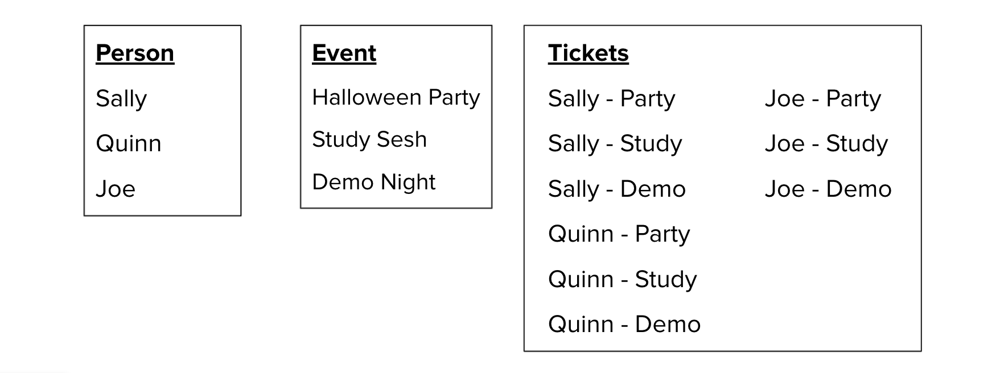

# Many-to-Many Relationships

A **many-to-many relationship** describes a scenario between entities `X` and `Y` as: "One X can have many Y, and one Y can have many X".

Let's take an example: On an events website, a `User` can RSVP to many `Events`, _and_ each `Event` can be attended by many `User`s. 

**IMPORTANT**: To identify a many-to-many relationship, it is _not enough_ to just examine the relationship in one direction! You need to know whether it is "many" in _both_ directions in order to classify it as either one-to-many or many-to-many.

## Challenge: Song & Album

<FlashCard>
<Prompt>

Let's say you are building a website to keep track of songs and the albums they belong to. For example, the song "Come Together" by The Beatles belongs to the album "Abbey Road", but it also can be found on the album "Beatles Greatest Hits".

**What should be the relationship between `Song` and `Album`?**

</Prompt>
<Answer>

The answer is that **it depends**! You'll need to make a choice: If one song is on two different albums, then are they actually the same song? Or are they two different songs that just happen to have the same name and contents?

- If a song on two different albums counts as the same song, then Album -- Song would be a **one-to-many relationship**.

- If a song on different albums counts as two different songs, then Album -- Song would be a **many-to-many relationship**.

The takeaway here is that **programming doesn't always have simple answers**! Often, there is room for discussion on how to resolve a particular problem.

</Answer>
</FlashCard>

## Re-Writing Relationships with a Bridge Table

It is often beneficial to re-write a many-to-many relationship as **two one-to-many relationships**. In fact, _every_ many-to-many relationship can be re-written this way!

Let's take the example of `Person` and `Event`. Our original diagram looked like this:

However, we can add a third entity, `Ticket`, which represents the link between a `Person` object and an `Event` object. That is, _every_ time a person RSVPs to an event, they _must_ have a ticket! Now, the diagram will look like this:

Here, the `Ticket` entity would be called a **bridge class** or a **bridge table**. When we start writing our database schemas, you'll need to represent _every_ many-to-many relationship this way. (Stay tuned for the SQL chapter to see why!)

Another way to think of it is, If I have 3 people who are each attending 3 events, I would have **9 different tickets** in the database. That is, there is _one and only one_ ticket object for each `Person` -- `Event` pair.

## Challenge: Student & Course

Let's try another example. Let's say we are developing a new version of the Make School website to track students and the courses they are enrolled in. Currently, we have two entities for `Student` and `Course`. This is a many-to-many relationship - that is, one student can be enrolled in many courses, and one course can be taken by many students.

<FlashCard>
<Prompt>

**Re-write this relationship by adding a bridge table.** You'll need to come up with a name for your bridge table, then re-draw the diagram as two one-to-many relationships.

</Prompt>
<Answer>

Here's an example of how you could re-write this relationship:

The `Enrollment` entity can be a valid bridge, because there is one and only one `Enrollment` for each `Student` -- `Course` pair.

</Answer>
</FlashCard>

**HINT**: If you can't think of a good name for your bridge table, you can always just concatenate the two table names together - so, the bridge table for `Student` and `Course` would be `StudentCourse`.

## Exercise: Re-Write Relationships

TODO: Add exercise
